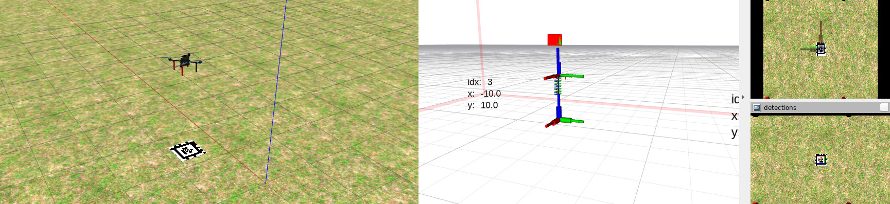

# MRS Precise Landing

Autonomous precise landing on an AprilTag.



## Installation

For deployment:
`sudo apt install ros-noetic-mrs-precise-landing`

For simulations:
`sudo apt install ros-noetic-mrs-precise-landing-gazebo`

## Dependencies

* `apriltag_ros`
* `uav_core`

## Components

* AprilTag detector
* [Landing Pad Estimator](./ros_packages/mrs_landing_pad_estimation)
* [Precise Landing Controller](./ros_packages/mrs_precise_landing)
* [Gazebo Resources for testing](./ros_packages/mrs_precise_landing_gazebo)

## Example simulation

```bash
roscd mrs_precise_landing_gazebo
./tmux/start.sh
```

## How to use it

The default [apriltag](./ros_packages/mrs_precise_landing_gazebo/models/Apriltag_recursive1/materials/textures/atag_rec1.png) is an embedded tag (TagCustom48h12): with tag 0 (0.3 meter inner size) on the outside and 10 (0.06 meter inner size) on the inside.
The total outside size of the tag is 0.5 meter.
However, this can be easily changed in the config files.

You will need to prepare:

* config file for the april tag detector, e.g., [apriltag.yaml](./ros_packages/mrs_precise_landing_gazebo/tmux/config/apriltag.yaml)
* camera node name, camera topic name (such that `/$UAV_NAME/camera_node/camera_topic`)
* the ids of the AprilTags need to be filled in the custom config for the estimator, e.g., [landing_estimator.yaml](./ros_packages/mrs_precise_landing_gazebo/tmux/config/landing_estimator.yaml)
* how should the heading be controlled?, prepare the controller config, e.g., [landing_controller.yaml](./ros_packages/mrs_precise_landing_gazebo/tmux/config/landing_controller.yaml)

An example of how to start the nodes using the custom configs:
```bash
roslaunch mrs_precise_landing precise_landing.launch apriltag_config:=`rospack find mrs_landing_pad_estimation`/config/apriltag_recursive.yaml camera_node:=bluefox_optflow image_topic:=image_raw estimator_config:=<landing_estimator> controller_config:=<landing_controller>
```

When the AprilTag is in the view, call:
```bash
rosservice call /$UAV_NAME/precise_landing/land
```

To abort, call:
```bash
rosservice call /$UAV_NAME/precise_landing/abort
```
